# Event Flow Diagrams - Divide and Conquer

This document provides detailed Mermaid flow diagrams for each producer-consumer pair in the Kafka-based e-commerce order processing system.

---

## Table of Contents

1. [Order Service Flow](#1-order-service-flow)
2. [Payment Service Flow](#2-payment-service-flow)
3. [Inventory Service Flow](#3-inventory-service-flow)
4. [Notification Service Flow](#4-notification-service-flow)
5. [Complete End-to-End Flow](#5-complete-end-to-end-flow)
6. [Error Handling Flows](#6-error-handling-flows)

---

## 1. Order Service Flow

### 1.1 Order Producer → Order Created Topic

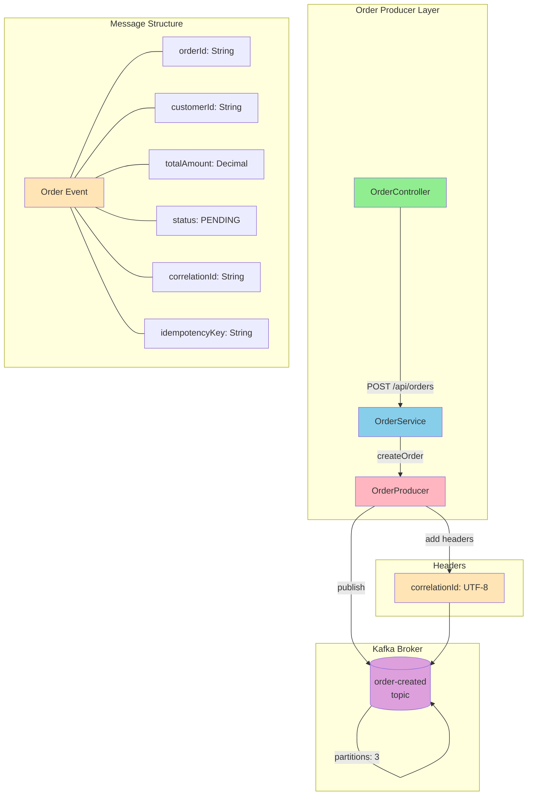

### 1.2 Order Consumer - Processing Order Created Events

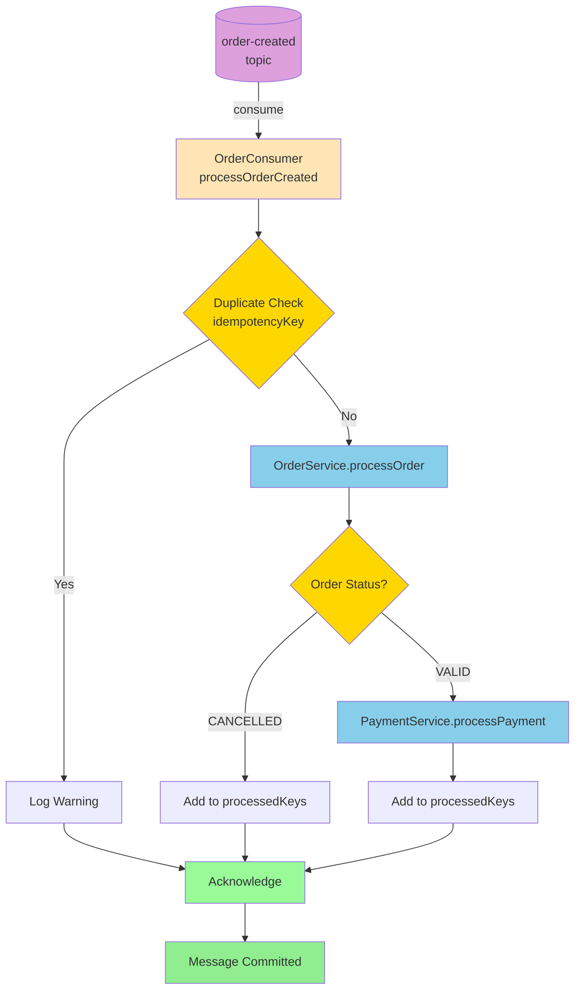

### 1.3 Order Consumer - Multiple Event Handlers

```mermaid
flowchart TB
    subgraph "Order Topics"
        T1[(order-created)]
        T2[(order-confirmed)]
        T3[(order-cancelled)]
        T4[(order-failed)]
    end

    subgraph "OrderConsumer"
        H1[@KafkaListener<br/>order-processor-group]
        H2[@KafkaListener<br/>order-notification-group]
        H3[@KafkaListener<br/>order-cancellation-group]
        H4[@KafkaListener<br/>order-failure-group]
    end

    T1 --> H1
    T2 --> H2
    T3 --> H3
    T4 --> H4

    H1 --> P1[Process Order + Payment]
    H2 --> P2[Log for Notification]
    H3 --> P3[Acknowledge Cancellation]
    H4 --> P4[Acknowledge Failure]

    style T1 fill:#DDA0DD
    style T2 fill:#DDA0DD
    style T3 fill:#DDA0DD
    style T4 fill:#DDA0DD
    style H1 fill:#FFE4B5
    style H2 fill:#FFE4B5
    style H3 fill:#FFE4B5
    style H4 fill:#FFE4B5
    style P1 fill:#87CEEB
    style P2 fill:#87CEEB
    style P3 fill:#87CEEB
    style P4 fill:#87CEEB
```

---

## 2. Payment Service Flow

### 2.1 Payment Producer → Payment Events

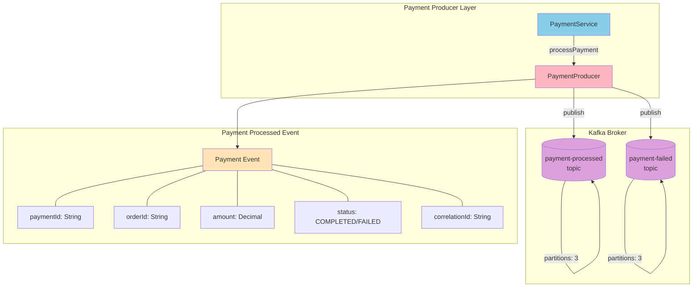

### 2.2 Payment Consumer - Payment Processed Flow

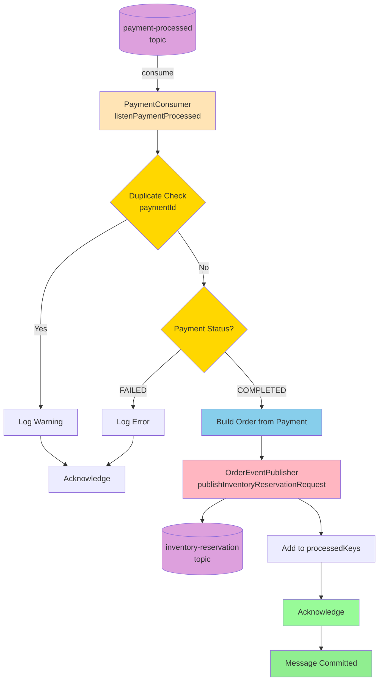

### 2.3 Payment Consumer - Payment Failed Flow

```mermaid
flowchart TD
    A[(payment-failed<br/>topic)] -->|consume| B[PaymentConsumer<br/>listenPaymentFailed]
    
    B --> C{Duplicate Check<br/>paymentId}
    C -->|Yes| D[Log Warning]
    C -->|No| E[Build Order from Payment]
    
    D --> F[Acknowledge]
    
    E --> G[OrderEventPublisher<br/>publishOrderFailed]
    G --> H[(order-failed<br/>topic)]
    
    G --> I[Add to processedKeys]
    I --> F
    F --> J[Message Committed]
    
    subgraph "DLT Handler"
        K[@DltHandler<br/>handleDlt]
        L[Log Payment Details]
        M[Alert Operations]
        K --> L --> M
    end

    H -.->|on failure| K

    style A fill:#DDA0DD
    style B fill:#FFE4B5
    style C fill:#FFD700
    style E fill:#87CEEB
    style G fill:#FFB6C1
    style H fill:#DDA0DD
    style F fill:#98FB98
    style J fill:#90EE90
    style K fill:#FF6B6B
```

---

## 3. Inventory Service Flow

### 3.1 Inventory Producer → Inventory Events

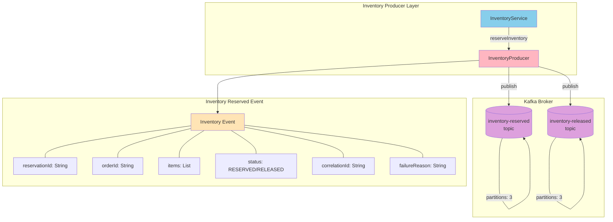

### 3.2 Inventory Consumer - Reservation Request Flow

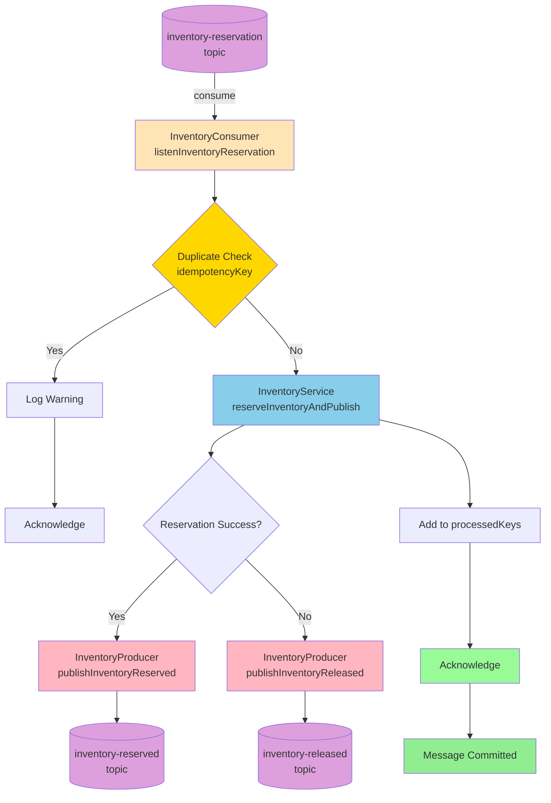

### 3.3 Inventory Consumer - Inventory Reserved Flow

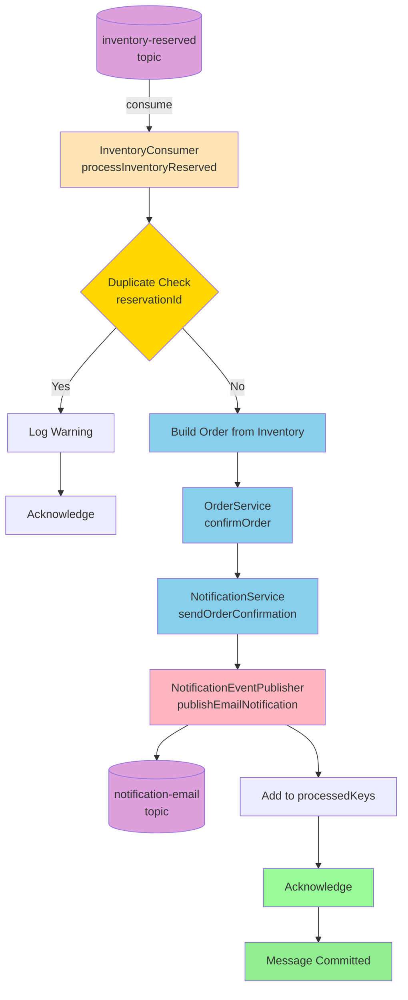

### 3.4 Inventory Consumer - Inventory Released Flow

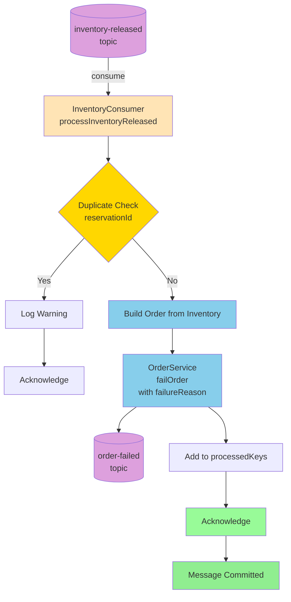

---

## 4. Notification Service Flow

### 4.1 Notification Producer → Notification Events

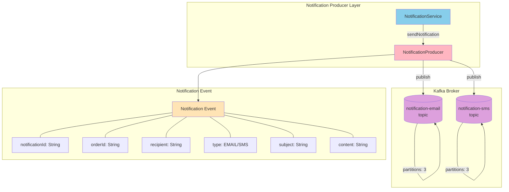

### 4.2 Notification Consumer - Email Notification Flow

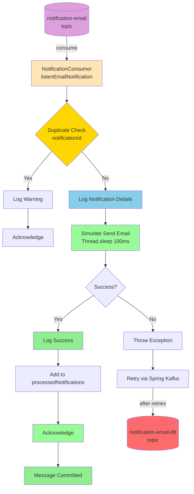

### 4.3 Notification Consumer - SMS Notification Flow

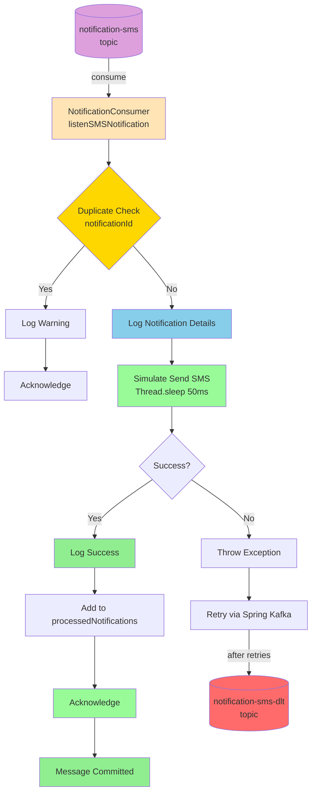

---

## 5. Complete End-to-End Flow

### 5.1 Happy Path - Order Success Flow

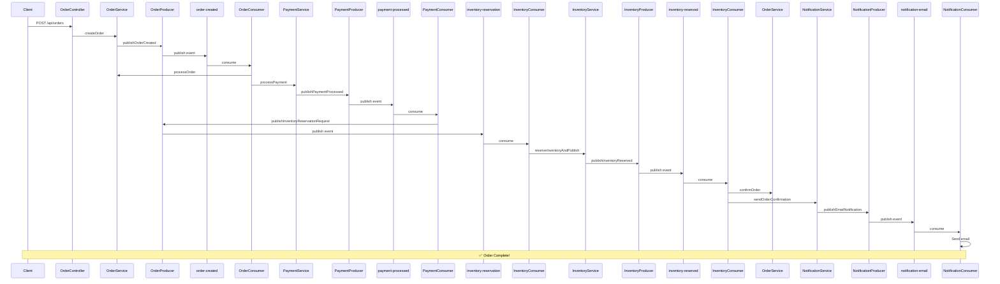

### 5.2 Component Architecture Overview

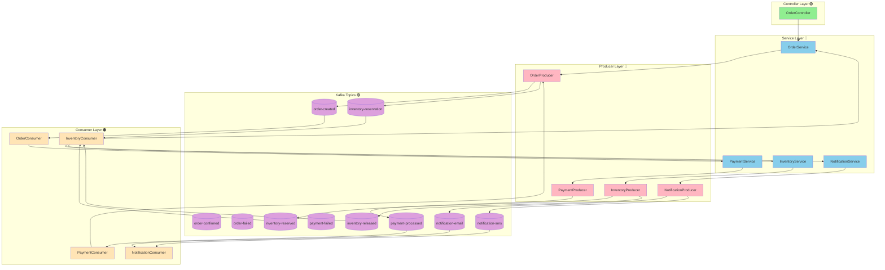

---

## 6. Error Handling Flows

### 6.1 Error Flow - Payment Failure

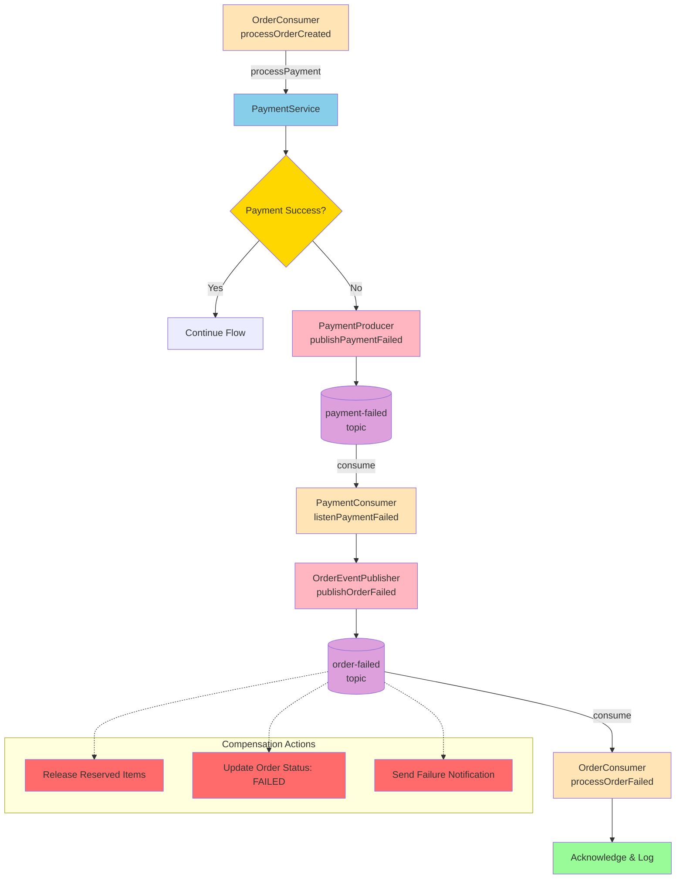

### 6.2 Error Flow - Inventory Reservation Failure

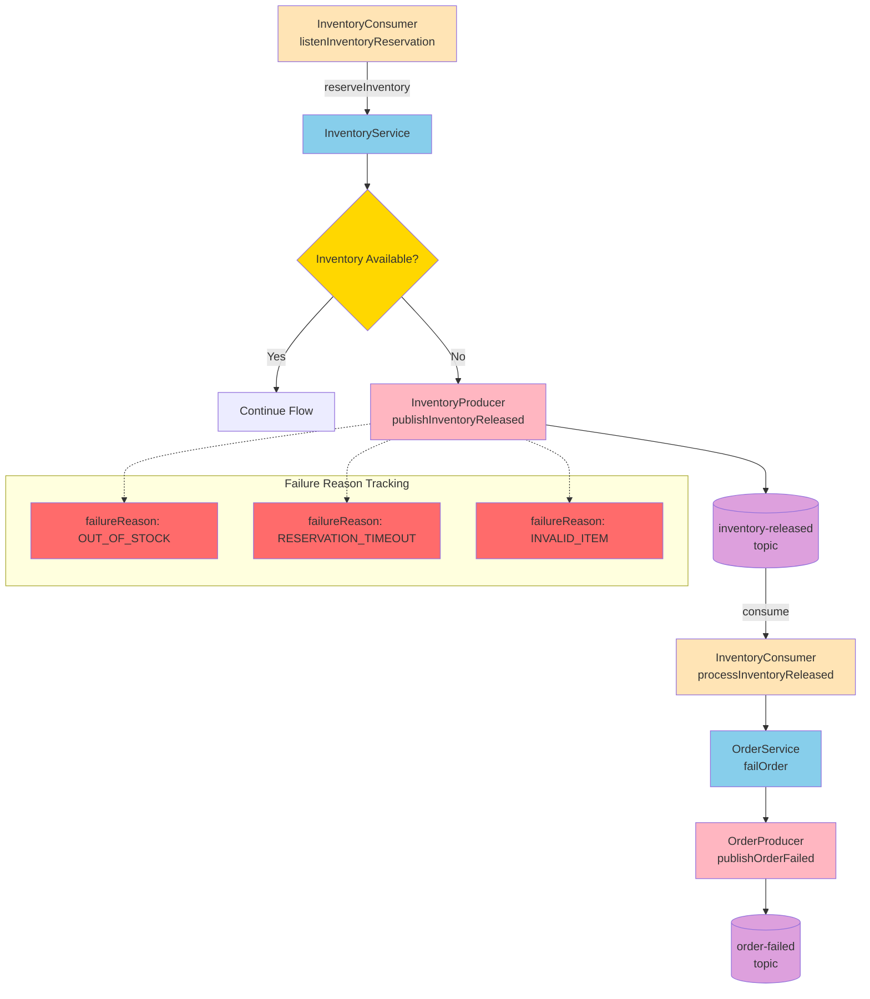

### 6.3 Error Flow - Dead Letter Topic Handling

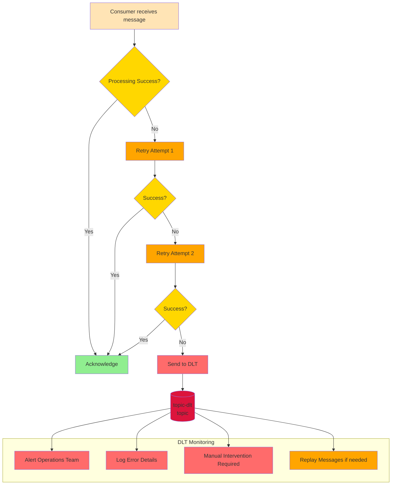

### 6.4 Retry Configuration Flow

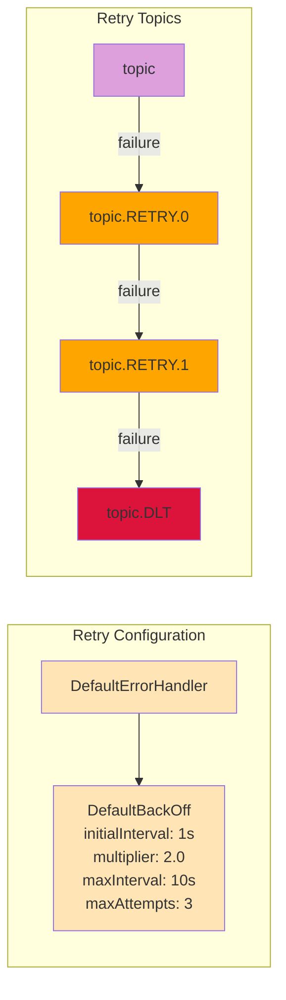

---

## 7. Topic Summary Table

| Topic | Partitions | Replicas | Producer | Consumer Group(s) |
|-------|-----------|----------|----------|-------------------|
| `order-created` | 3 | 1 | OrderProducer | order-processor-group |
| `order-confirmed` | 3 | 1 | OrderProducer | order-notification-group |
| `order-cancelled` | 3 | 1 | OrderProducer | order-cancellation-group |
| `order-failed` | 3 | 1 | OrderProducer | order-failure-group |
| `payment-processed` | 3 | 1 | PaymentProducer | payment-confirmation-group |
| `payment-failed` | 3 | 1 | PaymentProducer | payment-failure-group |
| `inventory-reservation` | 3 | 1 | OrderProducer | inventory-reservation-group |
| `inventory-reserved` | 3 | 1 | InventoryProducer | order-confirmation-group |
| `inventory-released` | 3 | 1 | InventoryProducer | inventory-failure-group |
| `notification-email` | 3 | 1 | NotificationProducer | notification-email-group |
| `notification-sms` | 3 | 1 | NotificationProducer | notification-sms-group |

---

## 8. Legend

| Color | Component Type |
|-------|---------------|
| 🟢 Green | Controller Layer (REST endpoints) |
| 🔵 Blue | Service Layer (Business logic) |
| 🔴 Red | Producer Layer (Event publishing) |
| 🟣 Purple | Kafka Topics |
| 🟠 Orange | Consumer Layer (Event handling) |
| 🟡 Yellow | Decision Points / Conditions |
| 🟢 Light Green | Success / Acknowledge |
| 🔴 Light Red | Error / Failure / DLT |

---

Happy Building! 🚀
